<div align="center">

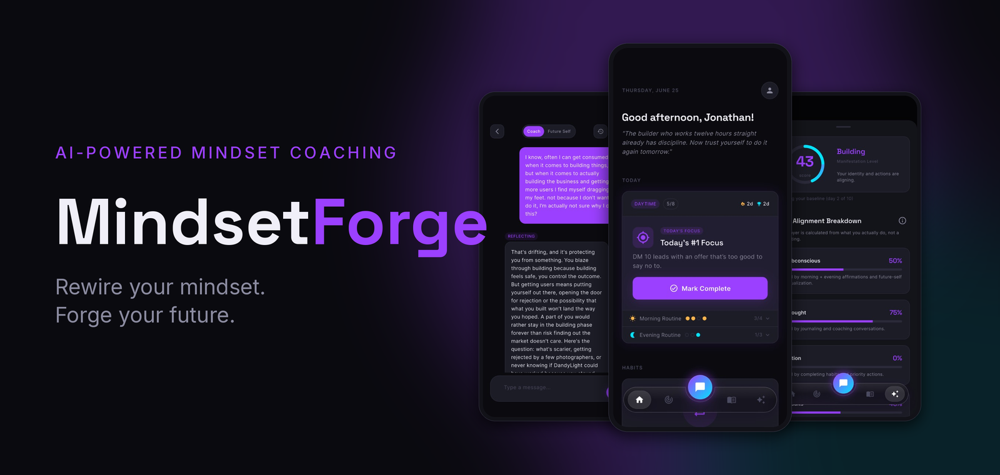

# MindsetForge

### Rewire your mindset. Forge your future.

**A premium, AI-powered mindset coaching app that turns personal growth into a measurable daily system.**

[](https://flutter.dev)
[](https://dart.dev)
[](https://firebase.google.com)
[](https://www.anthropic.com)
[](https://riverpod.dev)
[](#platform-support)

</div>

---

## Overview

**MindsetForge** is a cross-platform Flutter application that delivers personalized, AI-driven mindset coaching. Unlike generic "positive thinking" apps, MindsetForge is built around a structured, measurable **4-Layer Manifestation System** — pairing a personal AI coach (grounded in classic psychology and personal-development literature) with daily rituals, identity work, habit tracking, journaling, and an accountability network.

The product is designed to feel like a premium coaching service in your pocket: a dark-first, high-craft interface; an AI coach with memory and safety protocols; and quantified feedback that shows users whether their daily behavior is actually aligned with who they want to become.

> **Status:** Pre-launch (v1.0.0). Built as a production-grade application — clean architecture, typed data layer, server-side AI proxying, subscription monetization, and a viral accountability loop.

---

## Screenshots

<div align="center">

### The Daily System
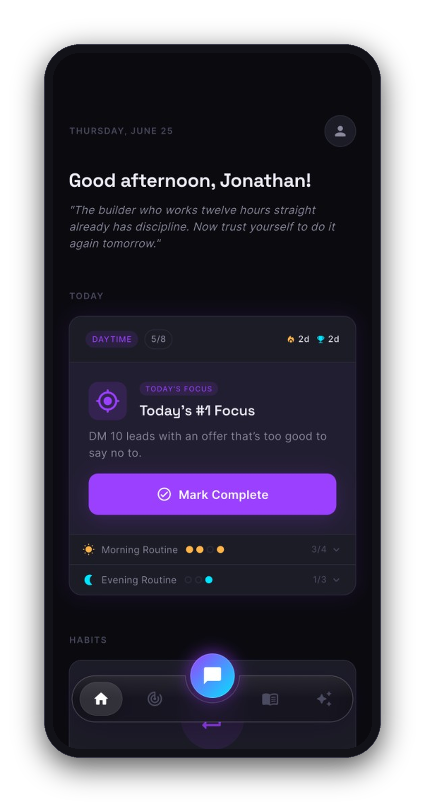&nbsp;
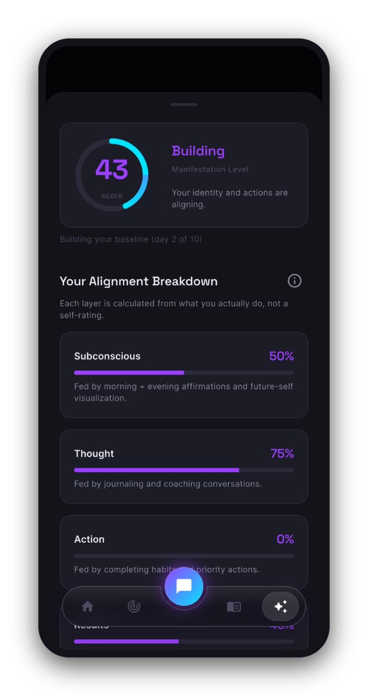&nbsp;
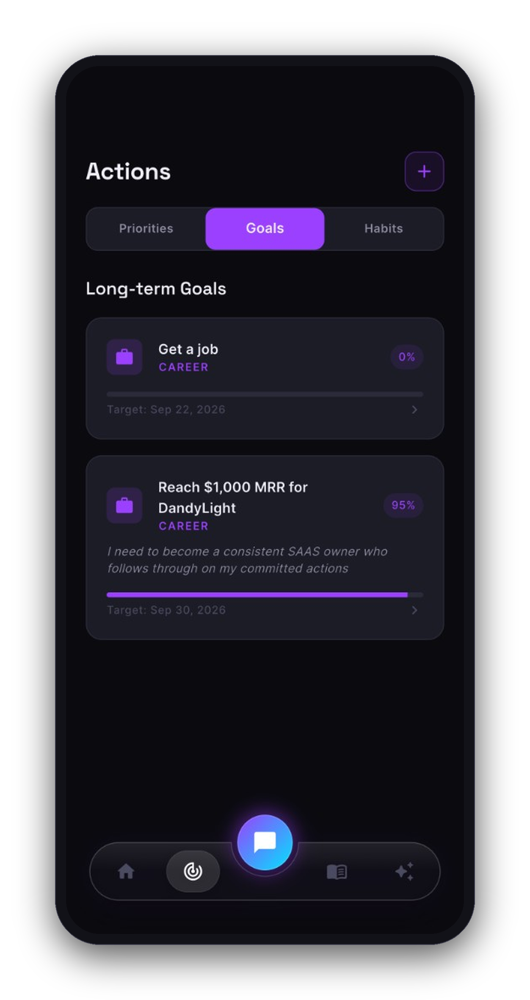

*Home dashboard with morning/day/evening rituals · the Manifestation Alignment Score broken down by layer · long-term goals with progress.*

### AI Coach
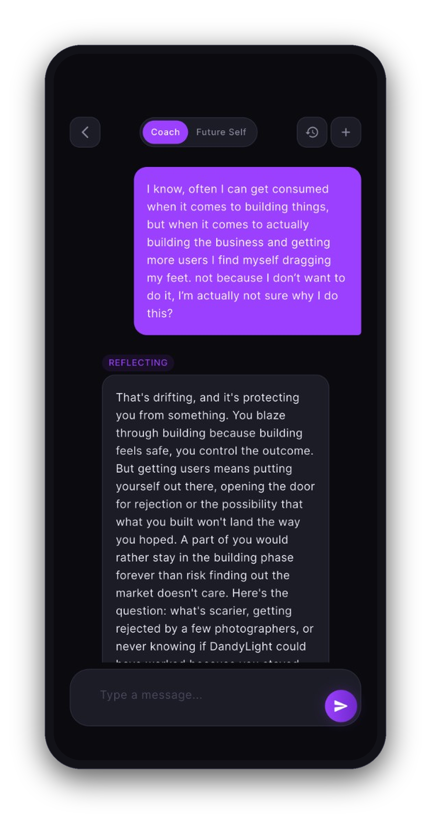

*The personal AI coach in "Reflecting" mode — grounded in classic mindset frameworks, with structured coaching responses and persistent memory.*

### Future Self Practice
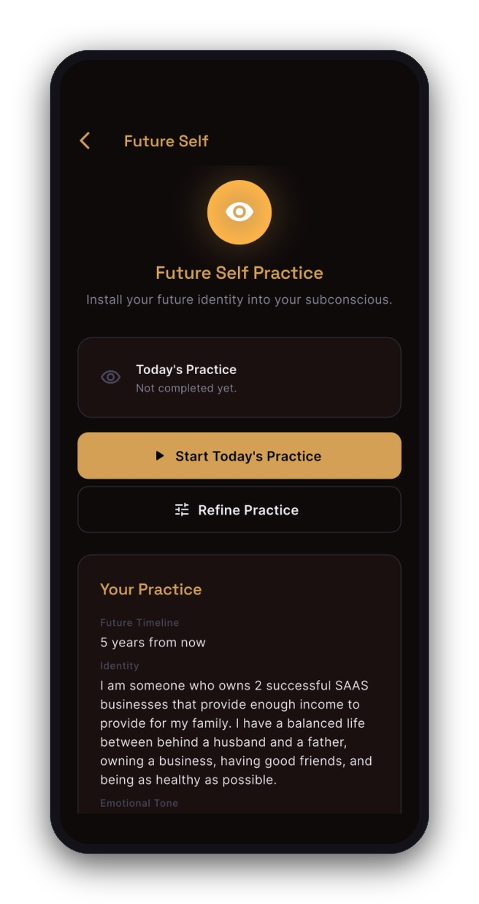&nbsp;
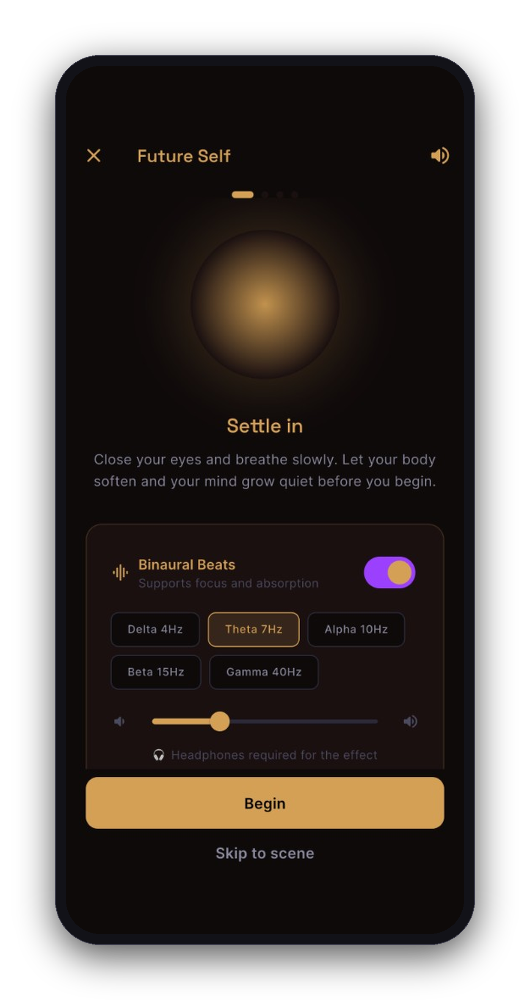&nbsp;
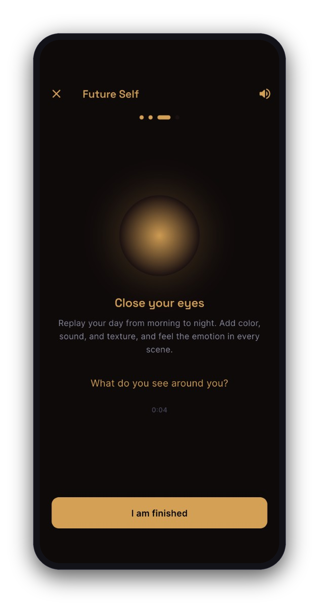

*Future Self Practice hub · guided settle-in with selectable binaural frequencies · the timed visualization experience.*

### Mindset & Blueprint
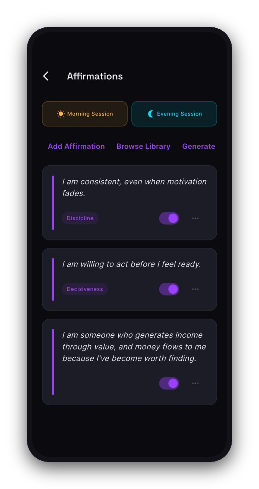&nbsp;
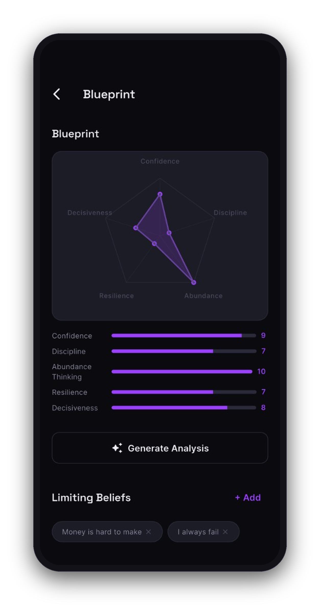&nbsp;
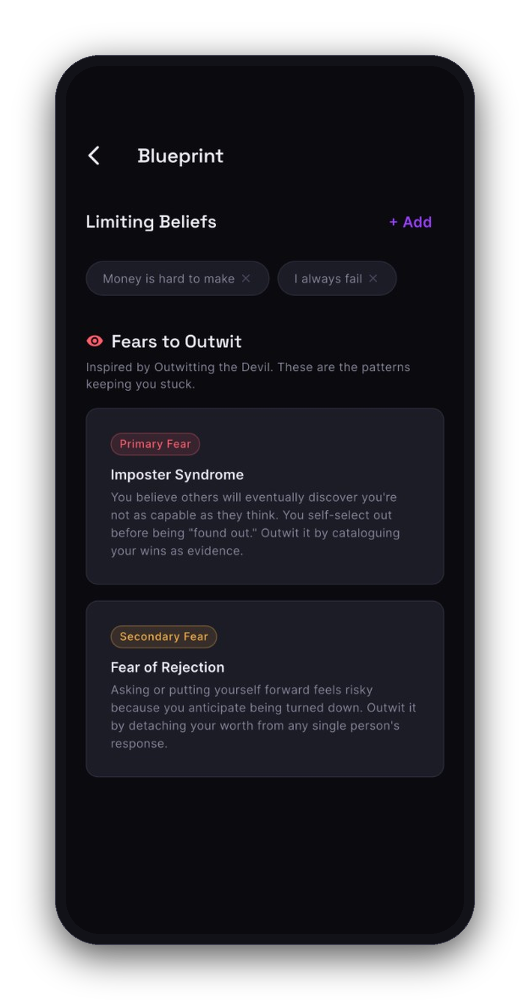&nbsp;
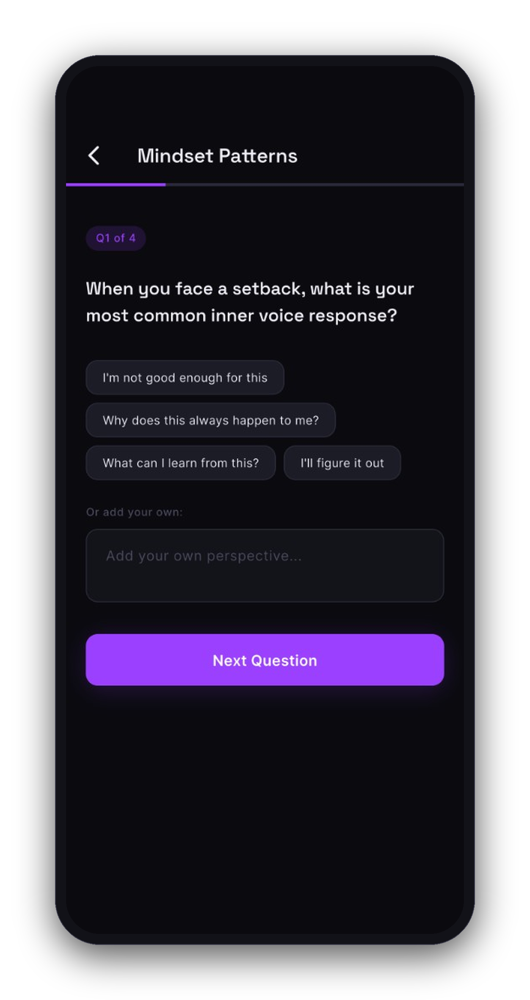

*Morning/evening affirmation sessions · the five-trait Mindset Blueprint radar · limiting beliefs & "fears to outwit" · the adaptive mindset assessment.*

</div>

---

## The Problem & The Approach

Most personal-growth apps stop at affirmations or habit checklists. They don't connect *internal* change (beliefs, identity, subconscious programming) to *external* results (goals, outcomes) — and they give users no way to know if they're actually making progress.

MindsetForge models personal transformation as **four interconnected layers**, each with dedicated tools and a contribution to a single **Manifestation Alignment Score**:

| Layer | Theme | In-App Tools |
|-------|-------|-------------|
| **1. Subconscious** | Foundation | Affirmations (morning/evening sessions), Future Self visualization with binaural audio |
| **2. Thoughts** | Awareness | AI Coach conversations, guided journaling (Reflect / Grow / Prime modes) |
| **3. Actions** | Discipline | Identity-based habits, daily priority actions, "today's #1 focus" |
| **4. Results** | Outcomes | Goals with AI-generated milestones and progress tracking |

The **Alignment Score** rolls these four layers into a single, trackable metric — turning an abstract idea ("work on your mindset") into a concrete, daily feedback loop.

---

## Key Features

### Personal AI Coach
- Conversational coaching powered by **Claude Sonnet 4.5**, proxied entirely through Firebase Cloud Functions (the API key never touches the client).
- Grounded in six classic frameworks (*Think and Grow Rich*, *Outwitting the Devil*, *Secrets of the Millionaire Mind*, *Mind Magic*, *177 Mental Toughness Secrets*, *How to Win Friends and Influence People*).
- **Persistent coach memory** — tracks commitments, recurring patterns, and context across sessions.
- **Structured responses** — every reply returns typed JSON (mode, framework, safety flag, memory updates) rather than free-form text.
- **Inline action suggestions** — the coach can propose goals, habits, affirmations, and Future Self practices directly inside the conversation.
- **Safety-first** — built-in crisis detection routes users to professional resources (988) and surfaces an in-app crisis resource card. Clear coaching-vs-therapy boundary.

### Future Self Practice
Guided identity-installation visualization with binaural audio — a structured embodiment practice rather than generic motivation.

### Daily Ritual System
A dashboard organized around a **morning → day → evening** arc, with affirmation sessions in the high-leverage subconscious-programming windows, a daily wins tracker, and a habit board.

### Goals, Habits & Priorities
AI-assisted goal breakdown into milestones, identity-based habit suggestions, and a "today's priorities" engine that keeps users focused on their single most important action.

### Journaling
Mode-based journaling (Reflect / Grow / Prime) with AI-generated prompts, mood tracking, and trend charts.

### Mindset Blueprint
A radar-chart assessment across five traits (Confidence, Discipline, and more), plus limiting-belief and fear tracking, with progressive deepening over time.

### Accountability Partners (Growth Loop)
- Invite partners via shareable universal links (`mindsetforge.app`).
- Partners join **free** and see a **privacy-curated** view of the user's progress.
- Partners can send encouragement (delivered via push), creating a built-in viral acquisition loop.

### Progress & Insights
Streaks, perfect-day tracking, an activity heatmap, and **AI-generated weekly insights** delivered via scheduled Cloud Functions.

### Monetization
Freemium model with a **RevenueCat**-powered subscription paywall gating premium features after onboarding.

---

## Tech Stack

| Layer | Technology |
|-------|-----------|
| **Framework** | Flutter (Dart 3.4+) |
| **State Management** | Riverpod (`StreamProvider`, `StateNotifierProvider`, derived providers) |
| **Routing** | GoRouter (declarative, with auth / onboarding / subscription guards) |
| **Backend** | Firebase — Auth, Cloud Firestore, Cloud Functions (v2, TypeScript), Cloud Messaging, Hosting |
| **AI** | Anthropic Claude Sonnet 4.5 via `@anthropic-ai/sdk`, with ephemeral prompt caching |
| **Auth** | Email/password, Google Sign-In, Apple Sign-In |
| **Monetization** | RevenueCat (`purchases_flutter`) |
| **Analytics** | Mixpanel |
| **UI/UX** | Google Fonts (Space Grotesk + Inter), `flutter_animate`, `fl_chart`, `confetti`, `shimmer` |
| **Audio** | `just_audio` (binaural beats for Future Self practice) |
| **Notifications** | FCM + `flutter_local_notifications` + timezone-aware scheduling |
| **Deep Links** | `app_links` (custom scheme + universal links) |

---

## Architecture

MindsetForge follows a strict, feature-first architecture with clean separation of concerns. The principle throughout: **widgets are dumb, state lives in notifiers, and all external access is funneled through dedicated services.**

```
lib/
├── core/
│   ├── ai/              # ClaudeService — all AI calls + prompt context building
│   ├── audio/           # Binaural beat controller
│   ├── constants/       # Design tokens (colors, spacing, typography) + content libraries
│   ├── firebase/        # FirestoreService, AccountabilityService — single data access points
│   ├── router/          # GoRouter config + route guards
│   ├── services/        # Analytics, deep links, notifications, scheduling
│   ├── theme/           # AppTheme
│   ├── utils/           # Date utils, validators, scoring, breakpoints
│   └── widgets/         # Shared reusable widgets (buttons, cards, nav shells)
├── features/            # 14 feature modules (one folder per feature)
├── models/              # 26 pure-Dart immutable data models (no Flutter/Firebase imports)
├── providers/           # 21 Riverpod providers
└── main.dart            # App bootstrap (Firebase, RevenueCat, Mixpanel, notifications)
```

### Architectural principles

- **Feature isolation** — features never import from other features; cross-feature coordination goes through `providers/`.
- **Single source of data access** — no widget or provider ever touches `FirebaseFirestore.instance` or `httpsCallable` directly. Firestore goes through `FirestoreService`; AI goes through `ClaudeService`.
- **Pure models** — all 26 models are immutable pure Dart with `copyWith`, null-safe `fromJson`/`toJson`, and computed getters. Zero Flutter or Firebase imports.
- **Optimistic state** — notifiers mutate state first, then persist, with `uid` guards and graceful failure handling.
- **Server-side AI** — the Anthropic key lives only in Firebase Secrets; the static coach system prompt is cached server-side, and the client sends only per-user context.

### Request flow (AI coaching)

```
Flutter Widget
  → Riverpod Notifier (e.g. ChatNotifier)
    → ClaudeService.completeConversation()
      → cloud_functions HTTPS callable (callClaudeConversation)
        → Firebase Cloud Function (auth-gated, TypeScript)
          → Anthropic Messages API (Claude Sonnet 4.5)
        ← structured JSON response
      ← parsed CoachReply (response, mode, framework, safety, memory_updates)
    ← optimistic UI update + coach memory persistence
```

### Data model

| Collection | Purpose |
|------------|---------|
| `users/{uid}` | The entire `UserProfile` — goals, habits, affirmations, completions, blueprint, subscription, partners (stored as fields for cheap reads) |
| `journals/{entryId}` | Journal entries (separate collection — high write volume) |
| `chat_sessions/{sessionId}` | Coach and Future Self conversations |

### Cloud Functions

**AI:** `callClaude` (single-turn), `callClaudeConversation` (multi-turn coach chat with prompt caching).

**Monetization:** `revenueCatWebhook` (syncs subscription status).

**Accountability:** `sendPartnerInviteEmail`, `acceptPartnerInvite`, `getPartnerProgress`, `sendEncouragement`, `removePartner`, `getPartnerInviteInfo`, `deleteUserAccount` (GDPR-style deletion).

**Scheduled (cron):** `weeklyMindsetAnalysis`, `weeklyManifestationReport`, `lowActivityAlert`, `partnerAccountabilityDaily`, `weeklyPartnerDigest`.

---

## Getting Started

### Prerequisites

- [Flutter SDK](https://docs.flutter.dev/get-started/install) 3.4 or higher
- A [Firebase](https://firebase.google.com) project (Auth, Firestore, Functions, Messaging enabled)
- An [Anthropic API key](https://console.anthropic.com)
- (Optional) [RevenueCat](https://www.revenuecat.com) account for subscriptions
- (Optional) [Mixpanel](https://mixpanel.com) project token for analytics
- Node.js 18+ (for Cloud Functions)

### 1. Clone & install

```bash
git clone https://github.com/<your-username>/MindsetForge.git
cd MindsetForge
flutter pub get
```

### 2. Configure Firebase

Use the FlutterFire CLI to generate `lib/firebase_options.dart` for your own project:

```bash
dart pub global activate flutterfire_cli
flutterfire configure
```

Then enable in the Firebase Console:
- **Authentication** → Email/Password, Google, Apple
- **Cloud Firestore**
- **Cloud Functions**
- **Cloud Messaging**

### 3. Set up Cloud Functions & secrets

```bash
cd functions
npm install

# Store your Anthropic key as a Firebase Secret (never commit it)
firebase functions:secrets:set ANTHROPIC_API_KEY

firebase deploy --only functions
```

### 4. Configure third-party keys

- **RevenueCat:** add your iOS / Android public SDK keys where the client initializes `purchases_flutter` (see `main.dart`).
- **Mixpanel:** add your project token where `AnalyticsService` is initialized.

### 5. Run the app

```bash
flutter run
```

---

## Testing & Quality

```bash
flutter analyze          # static analysis (flutter_lints)
flutter test             # run the unit test suite
```

Current automated coverage includes unit tests for core models (`Goal`, `Habit`, `DailyCompletion`) and key notifiers (`GoalsNotifier`, `DailyCompletionNotifier`), using **Mockito** + **build_runner** with a shared `MockFirestoreService`. The architecture is designed for testability — pure models and dependency-injected services make expanding coverage straightforward.

---

## Platform Support

| Platform | Status |
|----------|--------|
| **iOS** | Fully supported (primary) |
| **Android** | Fully supported (primary) |
| **Web** | Supported (platform-specific services gracefully degrade) |
| **macOS** | Supported |

Mobile is portrait-only by design.

---

## Design System

MindsetForge ships with a cohesive, dark-first design system. All visual values are tokenized — never hardcoded:

- **Palette:** deep near-black background stack (`#0A0A0F` → elevated surfaces) with a `#9B40FF` purple primary and `#00E5FF` cyan secondary.
- **Typography:** Space Grotesk for display/headlines, Inter for body and labels.
- **Components:** a shared widget library (`AppPrimaryButton`, `AppCard`, `AppTextField`, `EmptyState`, shimmer skeleton loaders, responsive layout wrappers) ensures visual consistency across every screen.
- **Motion:** `flutter_animate` entrance animations, staggered list reveals, and confetti celebrations for milestone moments.

---

## Disclaimer

MindsetForge provides **mindset coaching for personal development — it is not therapy, medical advice, or a substitute for professional mental health care.** The app includes crisis-detection safeguards that route users to professional resources (e.g., the 988 Suicide & Crisis Lifeline) when appropriate. If you are in crisis, please contact a qualified professional or emergency services.

---

## License

Proprietary. All rights reserved. © 2026 MindsetForge.

This repository is shared for portfolio and demonstration purposes. Please do not redistribute or reuse without permission.
